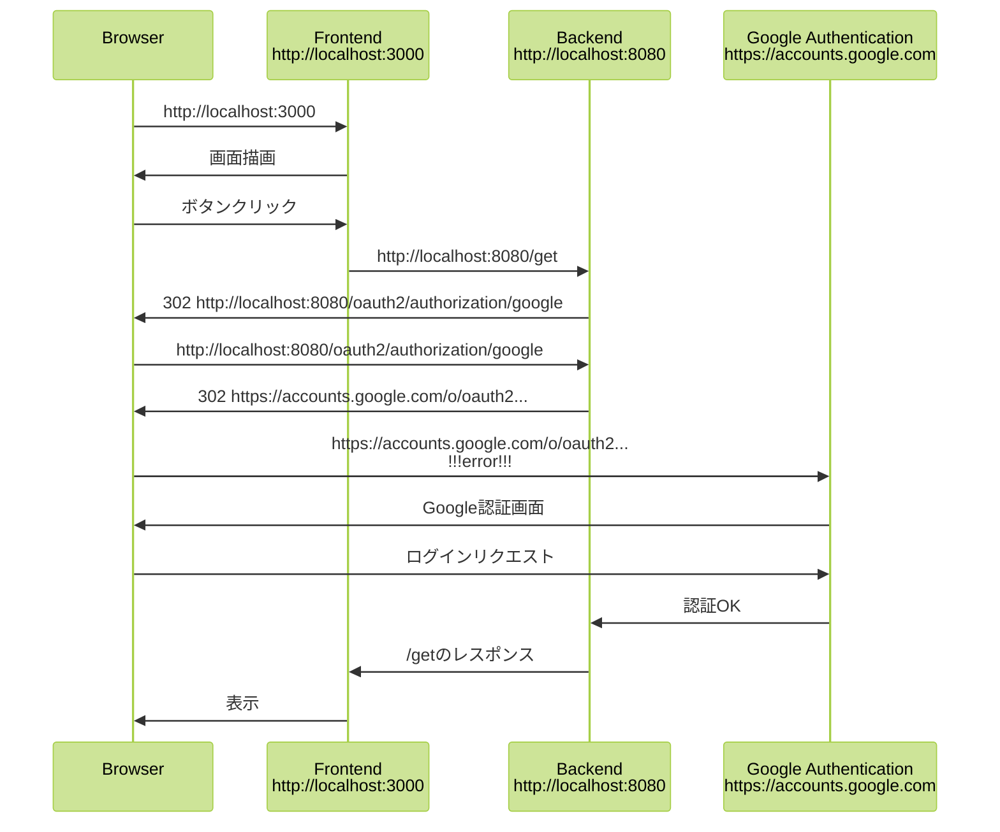
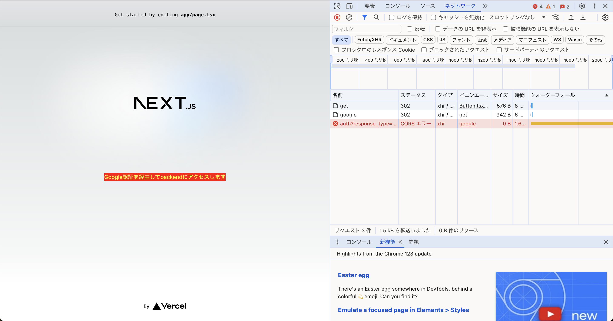
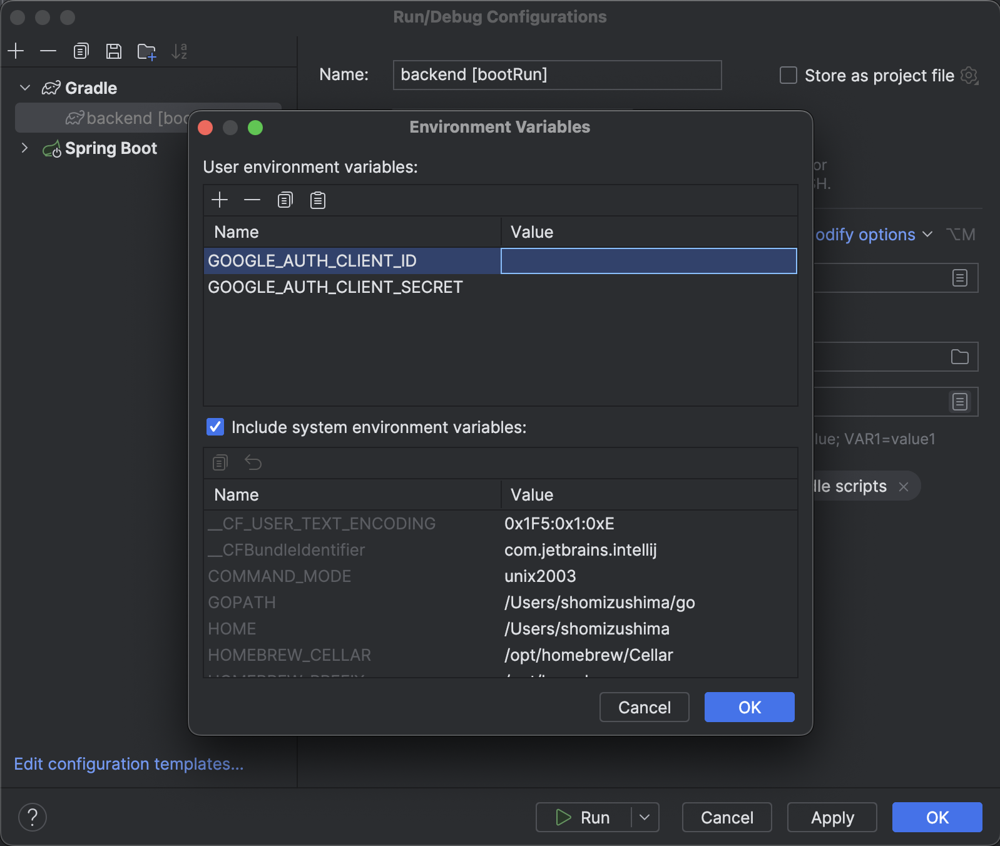

# frontend-backend-auth
backendでGoogle認証を行い、フロントエンドはbackend側のリダイレクトに従う。  
下記のような流れで動き、google認証にリダイレクトする際に302エラーになることを確認できる。



# 必要な環境変数

|環境変数名|内容|
|---|---|
|GOOGLE_AUTH_CLIENT_ID|OAuth クライアントID|
|GOOGLE_AUTH_CLIENT_SECRET|認証情報作成時のシークレット|

## docker-compose起動時の設定

1. 下記のような`.env`ファイルを作成してください（gitにはpushしないでください）

```
GOOGLE_AUTH_CLIENT_ID={value}
GOOGLE_AUTH_CLIENT_SECRET={value}
```

2. 起動

```
docker-compose up -d
```

3. ブラウザにアクセスして真ん中の赤いボタンを押すとバックエンドにリクエストが飛ぶ  
http://localhost:3000

4. エラーメッセージのダイアログと共に失敗します。ブラウザの開発者ツールで確認ができます。
   
   ```
   Access to XMLHttpRequest at 'https://accounts.google.com/o/oauth2/v2/auth?response_type=code&client_id=494203590440-90t9pj4qrp6vrse6f2800bvlebnauqcd.apps.googleusercontent.com&scope=openid%20profile%20email&state=1mdv9tNIDDpUQ8wRK_MH0HVcGN47kV6EqiWZjWiuiKM%3D&redirect_uri=http://localhost:8080/login/oauth2/code/google&nonce=Qye8SmkhX7SMRrKgYCuluQlXf9JhulFbqSyR2EXkPDo' (redirected from 'http://localhost:8080/get') from origin 'http://localhost:3000' has been blocked by CORS policy: No 'Access-Control-Allow-Origin' header is present on the requested resource.
   ```

## IntelliJ起動時の設定

1. IntelliJ IDEAコンソールの上部 >［Run］>［Edit Configurations…］


1. Environment variables で上記2つを設定してください

cf) https://console.cloud.google.com/apis/dashboard


