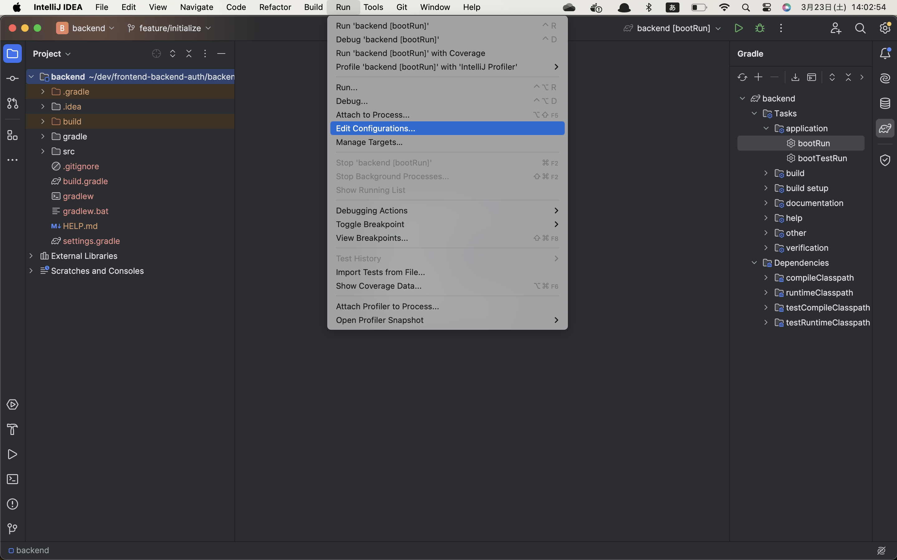
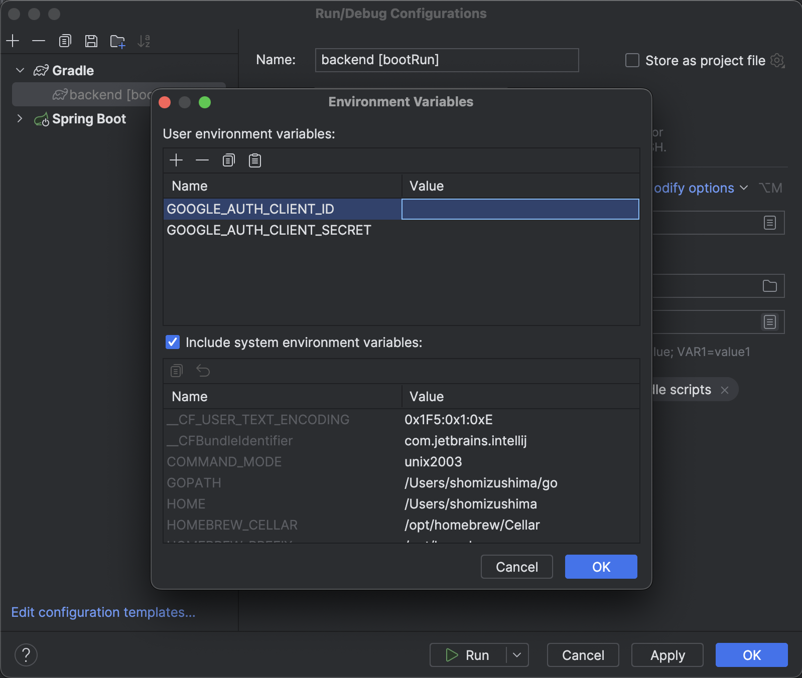

# frontend-backend-auth
backendでGoogle認証を行い、フロントエンドはbackend側のリダイレクトに従う

## IntelliJ起動時の設定

1. IntelliJ IDEAコンソールの上部 >［Run］>［Edit Configurations…］

1. Environment variables から下記の2つを設定してください

|環境変数名|内容|
|---|---|
|GOOGLE_AUTH_CLIENT_ID|OAuth クライアントID|
|GOOGLE_AUTH_CLIENT_SECRET|認証情報作成時のシークレット|

cf) https://console.cloud.google.com/apis/dashboard

