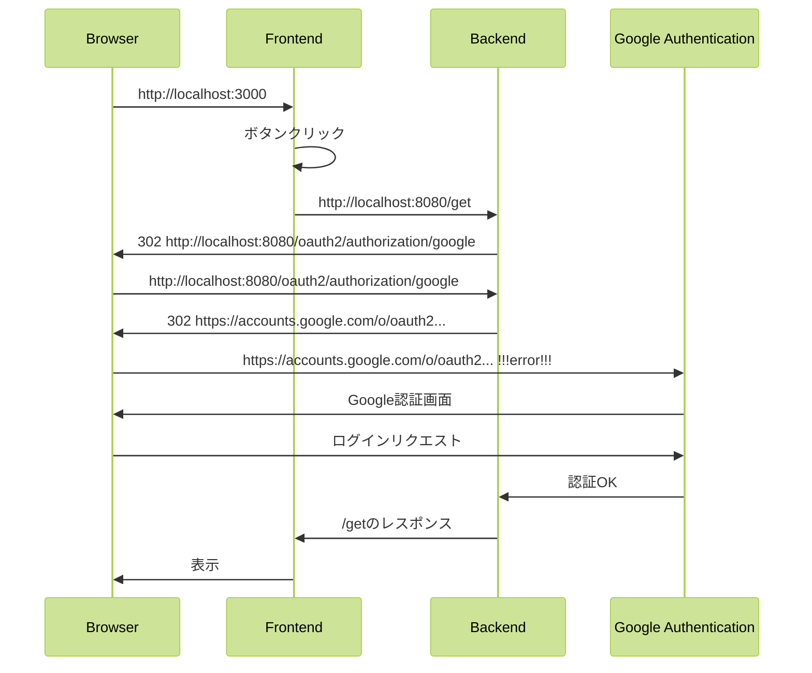

# frontend-backend-auth
backendでGoogle認証を行い、フロントエンドはbackend側のリダイレクトに従う。
下記のような流れで動き、google認証にリダイレクトする際に302エラーになることを確認できる。



# 必要な環境変数

|環境変数名|内容|
|---|---|
|GOOGLE_AUTH_CLIENT_ID|OAuth クライアントID|
|GOOGLE_AUTH_CLIENT_SECRET|認証情報作成時のシークレット|

## docker-compose起動時の設定

1. 下記のような`.env`ファイルを作成してください（gitにはpushしないでください）

```
GOOGLE_AUTH_CLIENT_ID={value}
GOOGLE_AUTH_CLIENT_SECRET={value}
```

## IntelliJ起動時の設定

1. IntelliJ IDEAコンソールの上部 >［Run］>［Edit Configurations…］


1. Environment variables で上記2つを設定してください

cf) https://console.cloud.google.com/apis/dashboard


